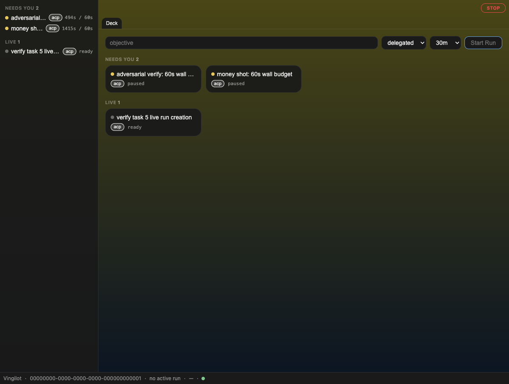
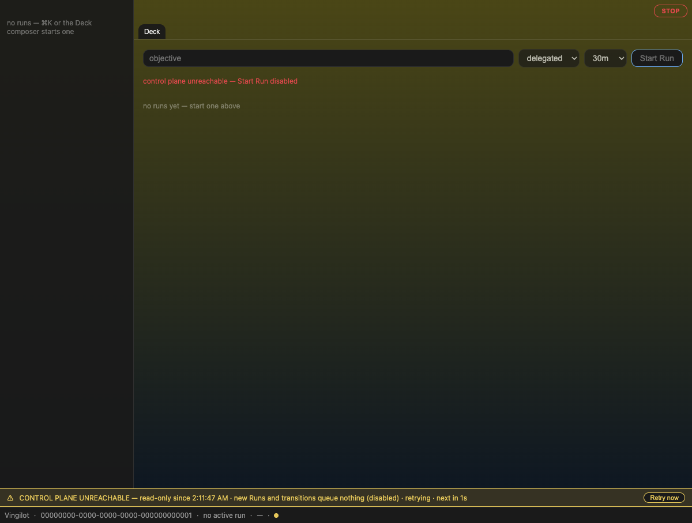

# Vingilot Workbench — runbook

The Workbench (`vingilot/workbench`) is Direction B's Run-primary shell: a
Run rail, workspace tabs, a status bar, a ⌘K palette, and hold-to-engage
STOP, rendering **live data from the coordinator's HTTP API**. This doc is
the "how do I run it" companion to the design docs in `docs/adr/` — what
works today, what is deliberately deferred, and the guard that keeps the
spike's zero-desktop-imports promise mechanical.

## Running it (3 commands)

```bash
# 1. the local Postgres the coordinator persists to (see docs/local-dev.md
#    for the full isolated stack — only Postgres is needed here)
docker compose up -d postgres

# 2. the coordinator, bound to 127.0.0.1:7117 with a fixed dev token
./vingilot/scripts/coordinator-run.sh

# 3. the Workbench dev server, proxying /coord -> the coordinator
pnpm --filter @vingilot/workbench dev
```

Open `http://localhost:5273`. The dev workspace id is hardcoded in
`App.tsx` (`WORKSPACE_ID`); on first load, if that workspace row doesn't
exist yet, `App.tsx` bootstraps it via an empty mutation batch (the
mutations endpoint has ensure semantics — see `App.tsx`'s bootstrap effect).

The bearer token (`vingilot-dev-token` by default) lives only in the Vite
dev-server process — `vite.config.ts`'s proxy injects the
`Authorization` header server-side. The browser never holds it.

## What works

- **Run rail** — NEEDS YOU / LIVE / RECENT groups with counts, ⌘1..9
  targets the nth row, mode chips follow the enforced/stated/absent form
  rule (`acp` solid, `int` dashed, `@ chat` borderless).
- **Deck** — composer bar creates a Run and provisions a single task
  worktree (`createRun` → `provisionRun`), three lanes mirror the rail as
  clickable cards.
- **Run view** — status/mode chips, a wall-clock budget as an **enforced,
  solid** meter and a token count as an **observed-only, dashed** readout
  that renders nothing at all when `tokens_observed_at` is null (a
  capability with no data renders nothing, not zero), the transition
  history newest-first, and an actions row derived from `legalNext(status)`
  — an illegal action is absent from the row, never a disabled button. A
  409 shows the server's `detail` inline.
- **STOP** — top-right, hold 600ms to engage; pauses every live run via the
  transition API and disables New Run until released.
- **⌘K palette** — typed rows, active-run scope ranked first.
- **The control plane can vanish and the shell says so** (this task,
  design 7c) — see below.
- **Reconciler enforcement, live**: the coordinator's `run_reconciler` now
  runs (5s interval, spawned from `main.rs` — it previously wasn't wired
  in at all, so nothing enforced wall-clock budgets outside tests). Create
  a Run with a short wall limit, Start it, wait, and it flips to `paused`
  on its own — the rail row moves from LIVE to NEEDS YOU and the Run view
  shows the `wall clock budget exhausted` transition.

## The unreachable lane (design 7c)

When the poll to `/coord/v1/workspaces/{id}/runs` stops succeeding, a
persistent, **non-dismissible** lane appears above the status bar:

> ⚠ CONTROL PLANE UNREACHABLE — read-only since \<t\> · new Runs and
> transitions queue nothing (disabled) · retrying · next in \<n\>s
> [Retry now]

While it's up:

- the rail keeps the **last-good** run list, every row stamped
  `· as of <t>`, rather than going blank;
- the Deck composer is disabled with the reason printed inline
  (`control plane unreachable — Start Run disabled`);
- the Run view's action row is disabled the same way;
- the status bar's sync dot goes from `--vg-sem-ok` (green) to
  `--vg-sem-attn` (amber).

It clears itself the instant reachability recovers — there is no manual
dismiss, because "the control plane is up again" isn't something the user
decides. **V1 queues nothing.** Disabled is the honest state; a fake write
queue that silently replays later is not (that's ADR-002's queued-write
pinning, explicitly deferred to the chat adapter).

### Screenshots

**Reachable** — rail populated from a live coordinator, sync dot green:



**Unreachable** — coordinator process killed; the lane appears, ticking:



**Recovered** — coordinator restarted; the lane is gone, sync dot green
again, without a page reload:


### A dev-proxy gap this task found and fixed

Killing the coordinator process while going through Vite's dev proxy does
**not** produce a fetch-level network error in the browser — Vite is still
up, so `fetch("/coord/...")` succeeds at the HTTP layer and comes back with
a bare `502 Bad Gateway` from the proxy itself (no body shaped like the
coordinator's own `{error, detail}` JSON). The original client only mapped
`kind: "unreachable"` off a thrown `TypeError` (a real DNS/connection
failure), so this 502 fell into the generic `kind: "api"` bucket and
`usePolling` treated it as "reachable but erroring" — the lane never
appeared. Live-testing this task's own "kill the coordinator" step is what
surfaced it.

Fixed in `src/api/coordinator.ts`: a `502`/`503`/`504` response with no
parseable coordinator-shaped JSON body is now also `kind: "unreachable"`,
since the coordinator's every real error path returns that JSON — a bodyless
gateway error can only have come from the proxy standing in for a dead
upstream. Covered by two new cases in `coordinator.test.mjs`: a bare 502
maps to `unreachable`; a 502 that *does* carry `{error, detail}` JSON (a
hypothetical coordinator-originated 502) stays `kind: "api"`.

## What is deferred

Recorded here rather than silently dropped:

- **Chat adapter + channel tabs** — the Workbench talks only to the
  coordinator; nothing bridges to Buzz's chat surface yet.
- **Terminal/PTY surface, multibuffer diff** — not part of this shell.
- **Deck membership sync** — Deck reads runs for one hardcoded workspace;
  no cross-workspace or membership model yet.
- **Tauri packaging** — this is a Vite dev-server app today, not a native
  shell.
- **Queued writes while unreachable** (ADR-002) — V1 disables instead of
  queuing; a real offline queue is client work for a later plan.
- **Per-mode token caps** — `wall_limit_secs` is enforced; token budgets
  are observed and displayed, not capped.

## The import guard as the adapter promise

`vingilot/workbench/scripts/check-import-edges.mjs` forbids every import
under `desktop/src/**` from `src/App.tsx`'s reachable graph — including
relative-path escapes, not just the (now-deleted) `@/` alias. This is
permanent CI, not a one-time spike check: the Workbench is a standalone
React app that talks to the coordinator over HTTP and nothing else. Any
future chat-adapter work has to cross that boundary through an explicit,
reviewed seam — never a bare import.
